# 👻 GH0ST: 2047 - Neural Guessing System

Um jogo de adivinhação com tema cyberpunk/hacker desenvolvido em C, utilizando a Raylib.


> 🆘 **Problemas para compilar?** Veja o [GUIA-RAPIDO.md](docs/GUIA-RAPIDO.md) com soluções para os erros mais comuns!

## 🎮 Sobre o Jogo

**GH0ST: 2047**é um jogo de adivinhação numérica ambientado em um universo cyberpunk, desenvolvido em linguagem C como parte de um projeto interdisciplinar universitário.

O jogador terá 7 tentativas para tentar invadir um sistema neural de segurança descobrindo um número secreto entre 1 e 100 antes que o sistema complete o rastreamento ativo da sua localização.

### 🚨 Sistema de Alertas Progressivos
- 🟢 **Tentativas 1-2**: Sistema Estável
- 🟡 **Tentativas 3-4**: Alerta Detectado
- 🔴 **Tentativas 5-7**: Rastreamento Ativo
- 💀 **FALHA**: BLOQUEADO

## ✨ Funcionalidades

### 🎨 Interface e Experiência

* Interface cyberpunk com efeitos neon e partículas
* Efeitos visuais inspirados em Matrix (rain, glow e particles)
* Sistema progressivo de alertas
* Navegação entre múltiplas telas
* Feedback visual dinâmico durante o gameplay

**➡️ [PROTOTIPO.md](docs/PROTOTIPO.md) - Protótipo de Interface do Jogo**

> 🎨 Confira o protótipo completo com todas as telas: menu, gameplay, alertas progressivos, estatísticas e tratamento de erros.

### 🎮 Gameplay

* Menu interativo com seleção de dificuldade (Fácil/Difícil)
* Geração aleatória de números
* Feedback em tempo real a cada tentativa (maior/menor)
* Sistema progressivo de tentativas
* IA com sugestões baseadas em busca binária
* Condição de vitória e derrota
* Reinicialização completa de partidas

### 🎥 Demo
[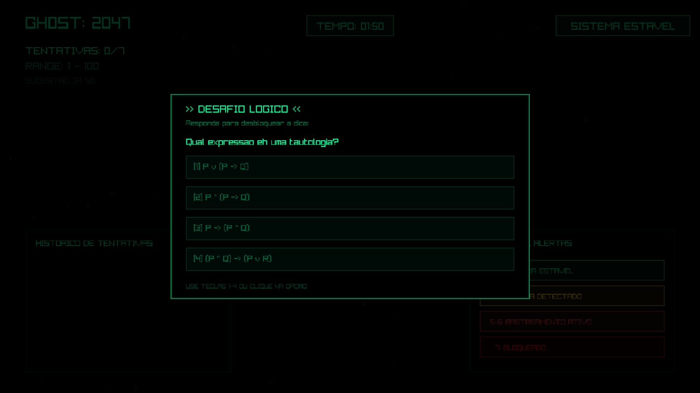](https://drive.google.com/file/d/1xicyQx_RYXewLUYpMHRgL0MGzOZug5va/view?usp=drivesdk)

### 📊 Estatísticas e Persistência

* Sistema de recordes (High Score)
* Estatísticas de desempenho do jogador
* Persistência de dados entre sessões
* Logging detalhado de gameplay em CSV
* Exportação automática de sessões para análise

### 🛡️ Sistema e Robustez

* Tratamento robusto de erros de entrada
* Validação de dados do usuário
* Estrutura modular em C
* Compatibilidade multiplataforma
  
 
> 📊 **Análise de Dados**: O jogo gera automaticamente `ghost2047_sessions.csv` com dados detalhados de cada partida. Veja [LOGGING-CSV.md](docs/LOGGING-CSV.md) para análise estatística!


## 🛠️ Tecnologias Utilizadas

| Tecnologia   | Função                          |
| ------------ | ------------------------------- |
| C11          | Linguagem principal             |
| Raylib       | Renderização gráfica e áudio    |
| Premake5     | Geração de projetos e makefiles |
| Make / MinGW | Sistema de build                |
| Git & GitHub | Controle de versão              |


## 📊 Estrutura do Projeto

```bash
ghost-2047/
├── src/                    # Código-fonte do jogo
├── include/                # Headers do projeto
├── resources/              # Assets (texturas, sons, dados)
├── build/                  # Scripts de build e premake
├── bin/                    # Executáveis compilados
├── docs/                   # 📚 Documentação completa
│   ├── INSTALACAO.md
│   ├── GUIA-RAPIDO.md
│   ├── LOGGING-CSV.md
│   ├── ARQUITETURA-MODULAR.md
│   └── assets/             # Imagens e vídeos
└── README.md               # Este arquivo
```

## 🕹️ Controles do Jogo

| Tecla / Entrada  | Função                     |
| ---------------- | -------------------------- |
| Teclado Numérico | Digite seu palpite (1–100) |
| ENTER            | Confirmar palpite          |
| BACKSPACE        | Apagar dígito              |
| ESC              | Sair do jogo               |
| Mouse            | Navegar pelos botões       |


## 📊 Planejamento do Projeto

O gerenciamento de escopo e a evolução do ciclo de vida do jogo **GH0ST: 2047** foram estruturados retroativamente utilizando a metodologia Scrum através do Trello. O Product Backlog foi mapeado a partir das 14 Histórias de Usuário (User Stories) priorizadas e distribuídas ao longo de 4 Sprints distintas, respeitando a linha do tempo real de desenvolvimento do ecossistema.

### 🏃‍♂️ Visão Geral do Board de Sprints
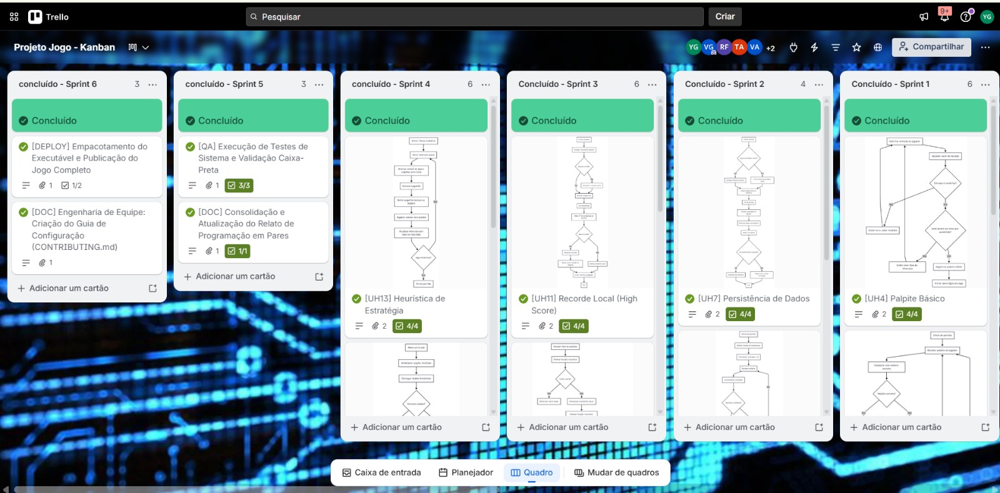

🔗 [Clique aqui para acessar o Board interativo no Trello](https://trello.com/b/SmP0X0Ae/projeto-jogo-kanban)

* **Sprint 1 — Concepção & Setup do Core Loop:** Alinhamento da ideia inicial, criação das personas e protótipo Lo-Fi. Em paralelo, foi feito o setup do repositório e o início do desenvolvimento do código-base (estrutura do loop principal do jogo).
* **Sprint 2 — Modelagem & Incremento de Código:** Construção dos diagramas de atividades para as histórias mapeadas enquanto o time avançava na codificação das primeiras mecânicas de entrada de dados e navegação do jogo.
* **Sprint 3 — Validação de Usabilidade & Expansão de Features:** Aplicação das Heurísticas de Nielsen na interface e testes de usabilidade. No código, houve a consolidação de features de alta prioridade (como o sistema de palpites e o gerador de números).
* **Sprint 4 — Refinamento, Testes de Sistema & Deploy:** Finalização das histórias restantes do backlog (módulo de estatísticas e persistência), aplicação de testes de sistema automatizados/manuais, correção de bugs via Issue Tracker e congelamento do código para o deploy final.

## 🐛 Rastreamento de Erros (Issue / Bug Tracker)

Como parte dos critérios de validação de Engenharia de Software, o grupo utilizou ativamente a aba *Issues* do repositório no GitHub para catalogar, documentar, priorizar e acompanhar a resolução de falhas identificadas durante as fases de testes.

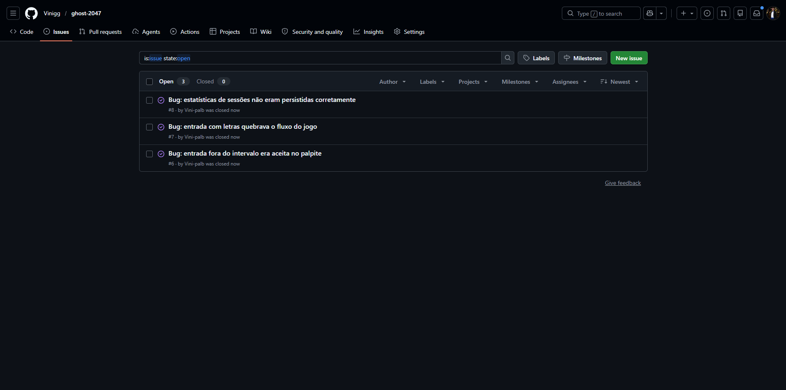

## 📋 Histórias de Usuário (Padrão 3Cs)

As funcionalidades do GH0ST: 2047 foram definidas com base em **histórias de usuário estruturadas no padrão 3Cs (Card, Conversation, Confirmation)**, garantindo rastreabilidade, clareza de requisitos e validação objetiva das entregas.

As features estão organizadas por **nível de prioridade e impacto no core do sistema**.

### Core Features (Alta Prioridade)

### 1. Interface Principal — Menu (UH1)

| **Elemento**     | **Descrição** |
|-----------------|--------------|
| **Card**        | Como jogador, quero um menu com as opções Jogar, Analisar e Sair, para que eu possa navegar facilmente pelas funcionalidades do sistema. |
| **Conversation** | • O menu principal deve exibir as opções ao iniciar o sistema <br> • Navegação visual entre opções com destaque da seleção atual <br> • Integração com telas de jogo e análise <br> • Encerramento correto da aplicação ao selecionar Sair |
| **Confirmation** | • [ ] Menu exibe as opções Jogar, Analisar e Sair ao iniciar <br> • [ ] Jogador visualiza qual opção está selecionada <br> • [ ] Selecionar Jogar inicia o jogo <br> • [ ] Selecionar Analisar abre a funcionalidade de análise <br> • [ ] Selecionar Sair encerra a aplicação corretamente |

### 2. Geração de Número (UH2)

| **Elemento**     | **Descrição** |
|-----------------|--------------|
| **Card**        | Como jogador, quero que o sistema gere um número aleatório secreto para que o desafio seja imprevisível a cada partida. |
| **Conversation** | • Geração de número pseudo-aleatório ao iniciar nova partida <br> • Intervalo definido pelo sistema (1 a 100) <br> • Número oculto para o jogador durante toda a partida <br> • Garantia de imprevisibilidade entre partidas |
| **Confirmation** | • [ ] Sistema gera automaticamente um número secreto ao iniciar a partida <br> • [ ] Número está dentro do intervalo definido (1 a 100) <br> • [ ] Número secreto não é exibido ao jogador <br> • [ ] Cada nova partida gera um número diferente |

### 3. Ciclo de Jogo com Feedback (UH3)

| **Elemento**     | **Descrição** |
|-----------------|--------------|
| **Card**        | Como jogador, quero tentar adivinhar o número e receber dicas de "maior" ou "menor", para que eu consiga completar a partida através de lógica. |
| **Conversation** | • Comparação do palpite com o número secreto <br> • Feedback textual indicando se o número secreto é maior ou menor <br> • Repetição do ciclo até o acerto <br> • Integração com sistema de tentativas |
| **Confirmation** | • [ ] Jogador pode inserir um palpite durante a partida <br> • [ ] Sistema compara o palpite com o número secreto <br> • [ ] Sistema informa se o número secreto é maior ou menor <br> • [ ] Processo se repete até o jogador acertar |

### 4. Palpite Básico (UH4)

| **Elemento**     | **Descrição** |
|-----------------|--------------|
| **Card**        | Como jogador, quero inserir um número via teclado para tentar adivinhar o valor secreto definido pelo sistema. |
| **Conversation** | • Captura de entrada numérica via teclado <br> • Validação de entradas numéricas válidas <br> • Verificação de intervalo permitido <br> • Registro como palpite válido no jogo |
| **Confirmation** | • [ ] Jogador insere um número utilizando o teclado <br> • [ ] Sistema aceita apenas entradas numéricas válidas <br> • [ ] Sistema valida se o número está dentro do intervalo permitido <br> • [ ] Valor inserido é considerado como palpite válido |

### 5. Condição de Vitória (UH5)

| **Elemento**     | **Descrição** |
|-----------------|--------------|
| **Card**        | Como jogador, quero ser notificado quando acertar o número para sentir a satisfação de concluir o desafio. |
| **Conversation** | • Detecção de acerto (palpite == número secreto) <br> • Exibição de mensagem clara de sucesso <br> • Encerramento ou redirecionamento pós-acerto <br> • Integração com sistema de pontuação e recordes |
| **Confirmation** | • [ ] Sistema identifica quando o jogador acerta o número secreto <br> • [ ] Mensagem clara de sucesso é exibida <br> • [ ] Partida é encerrada ou direcionada para o próximo passo |

### 6. Limite de Tentativas (UH6)

| **Elemento**     | **Descrição** |
|-----------------|--------------|
| **Card**        | Como jogador, quero ter um número máximo de tentativas para que o jogo tenha um nível de dificuldade e risco real. |
| **Conversation** | • Definição de limite máximo de tentativas (7) <br> • Contagem e atualização de tentativas realizadas <br> • Bloqueio de novos palpites ao atingir o limite <br> • Integração com sistema de alertas progressivos |
| **Confirmation** | • [ ] Sistema define número máximo de tentativas por partida <br> • [ ] Quantidade de tentativas é registrada e atualizada <br> • [ ] Novos palpites são impedidos ao atingir o limite <br> • [ ] Sistema encerra a partida e informa o jogador ao atingir o limite |

### Secondary Features (Média Prioridade)

### 7. Persistência de Dados (UH7)

| **Elemento**     | **Descrição** |
|-----------------|--------------|
| **Card**        | Como jogador, quero que meus resultados sejam salvos em um arquivo e carregados ao iniciar, para que meu progresso não seja perdido ao fechar o programa. |
| **Conversation** | • Salvamento de resultados em arquivo CSV ao final da partida <br> • Carregamento automático de dados ao iniciar o sistema <br> • Garantia de integridade dos dados existentes <br> • Persistência entre diferentes execuções do programa |
| **Confirmation** | • [ ] Sistema salva os resultados em arquivo ao final da partida <br> • [ ] Resultados previamente salvos são carregados automaticamente ao iniciar <br> • [ ] Dados permanecem disponíveis após fechar e reabrir o programa <br> • [ ] Arquivo é atualizado sem corromper dados existentes |

### 8. Tratamento de Erros (UH8)

| **Elemento**     | **Descrição** |
|-----------------|--------------|
| **Card**        | Como desenvolvedor, quero que o sistema valide se a entrada é um número válido para evitar que o programa trave com caracteres inválidos. |
| **Conversation** | • Validação de tipo numérico da entrada <br> • Impedimento de processamento de caracteres inválidos <br> • Exibição de mensagem de erro clara <br> • Continuidade do programa após entrada inválida |
| **Confirmation** | • [ ] Sistema valida se a entrada é um número válido <br> • [ ] Entradas com caracteres inválidos são impedidas <br> • [ ] Mensagem de erro clara é exibida <br> • [ ] Jogador pode tentar novamente sem encerrar o programa |

### 9. Reinicialização (UH9)

| **Elemento**     | **Descrição** |
|-----------------|--------------|
| **Card**        | Como jogador, quero ter a opção de jogar novamente após o fim de uma partida sem precisar reiniciar o programa manualmente. |
| **Conversation** | • Oferta de opção "jogar novamente" ao final da partida <br> • Escolha entre reiniciar ou encerrar <br> • Reset completo do estado (novo número, tentativas zeradas) <br> • Retorno ao fluxo de jogo sem reinício do programa |
| **Confirmation** | • [ ] Sistema oferece opção de jogar novamente ao final da partida <br> • [ ] Jogador pode escolher reiniciar ou encerrar <br> • [ ] Nova partida é iniciada com estado resetado |

### 10. Leitura e Parsing do Histórico (UH14)

| **Elemento**     | **Descrição** |
|-----------------|--------------|
| **Card**        | Como sistema, quero carregar o arquivo de histórico e reconstruir as sessões em memória, para que as funcionalidades de estatísticas, recursão e sugestões de estratégia tenham acesso aos dados de partidas anteriores. |
| **Conversation** | • Carregamento do arquivo de histórico ao iniciar a aplicação <br> • Parse de cada linha no formato `timestamp;alvo;tentativas;baixos;altos;palpites_csv` usando fgets <br> • Reconstrução das sessões em memória <br> • Disponibilização dos dados para módulos de estatísticas e heurísticas |
| **Confirmation** | • [ ] Sistema carrega o arquivo de histórico ao iniciar <br> • [ ] Cada linha é parseada no formato definido <br> • [ ] Sessões são reconstruídas corretamente em memória <br> • [ ] Dados carregados ficam disponíveis para estatísticas, cálculos recursivos e sugestões |

### Advanced Features (Baixa Prioridade / Diferencial)

### 11. Cálculos Base — Recursão (UH10)

| **Elemento**     | **Descrição** |
|-----------------|--------------|
| **Card**        | Como desenvolvedor, quero utilizar funções recursivas para calcular a soma, o valor mínimo, o máximo e a soma dos quadrados dos palpites, garantindo o rigor matemático exigido. |
| **Conversation** | • Implementação recursiva de soma total dos palpites <br> • Funções recursivas para mínimo e máximo <br> • Cálculo recursivo da soma dos quadrados para análise de variância <br> • Funções isoladas e reutilizáveis pelo sistema |
| **Confirmation** | • [ ] Funções recursivas retornam corretamente soma, mínimo, máximo e soma dos quadrados <br> • [ ] Cálculos consideram todos os palpites válidos da partida <br> • [ ] Nenhum erro de execução durante chamadas recursivas <br> • [ ] Funções operam corretamente sobre o histórico de dados |

### 12. Recorde Local — High Score (UH11)

| **Elemento**     | **Descrição** |
|-----------------|--------------|
| **Card**        | Como jogador, quero ver qual foi a menor quantidade de tentativas de todas as sessões para tentar superar meu próprio recorde. |
| **Conversation** | • Registro da menor quantidade de tentativas entre todas as partidas <br> • Exibição clara do recorde ao jogador <br> • Atualização automática ao bater o recorde <br> • Persistência entre diferentes sessões do jogo |
| **Confirmation** | • [ ] Sistema registra a menor quantidade de tentativas já alcançada <br> • [ ] Recorde é exibido de forma clara ao jogador <br> • [ ] Recorde é atualizado quando o jogador faz menos tentativas <br> • [ ] Recorde é persistido entre sessões |

### 13. Estatísticas Agregadas (UH12)

| **Elemento**     | **Descrição** |
|-----------------|--------------|
| **Card**        | Como jogador, quero acessar a opção "Analisar" para visualizar a média de tentativas e o desvio padrão das minhas partidas, permitindo uma análise do meu desempenho. |
| **Conversation** | • Disponibilização da opção Analisar no menu principal <br> • Cálculo de média de tentativas das partidas <br> • Cálculo de desvio padrão das tentativas <br> • Apresentação clara dos dados históricos |
| **Confirmation** | • [ ] Opção Analisar está disponível no menu principal <br> • [ ] Média de tentativas é calculada e exibida corretamente <br> • [ ] Desvio padrão é calculado e exibido <br> • [ ] Cálculos consideram os dados históricos e são apresentados de forma clara |

### 14. Heurística de Estratégia (UH13)

| **Elemento**     | **Descrição** |
|-----------------|--------------|
| **Card**        | Como jogador, quero receber sugestões textuais de estratégia (ex: "tente o ponto médio") baseadas no intervalo atual, para aprender a jogar de forma mais eficiente. |
| **Conversation** | • Geração de sugestões baseadas no intervalo atual do jogo <br> • Exibição em formato textual contextualizado <br> • Atualização a cada nova tentativa <br> • Coerência com palpites anteriores e estado atual |
| **Confirmation** | • [ ] Sistema gera sugestões de estratégia com base no intervalo atual <br> • [ ] Sugestões são exibidas em formato textual <br> • [ ] Sugestões são atualizadas a cada nova tentativa <br> • [ ] Recomendações são coerentes com os palpites anteriores e o estado da partida |


<div align="center">
  <h1>📐 Diagramas UML das Funcionalidades</h1>
</div>

Diagramas de fluxo representando a lógica de cada história de usuário do GH0ST: 2047. Clique no título da funcionalidade para ver o diagrama em tamanho completo.

## 📊 Visão Geral dos Diagramas

| Funcionalidade | Diagrama | Funcionalidade | Diagrama | Funcionalidade | Diagrama |
|---------------|----------|----------------|----------|----------------|----------|
| **[UH01. Interface Principal (Menu)](#uh01-interface-principal-menu)** | 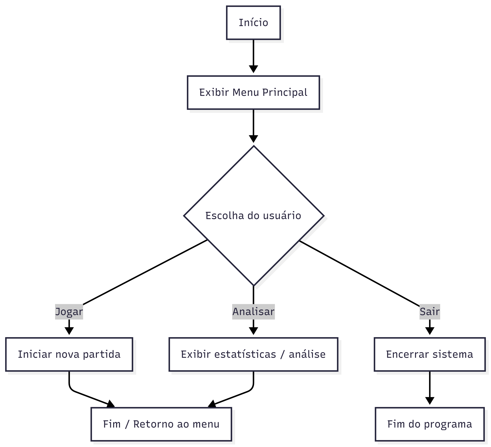 | **[UH02. Geração de Número](#uh02-geração-de-número)** | 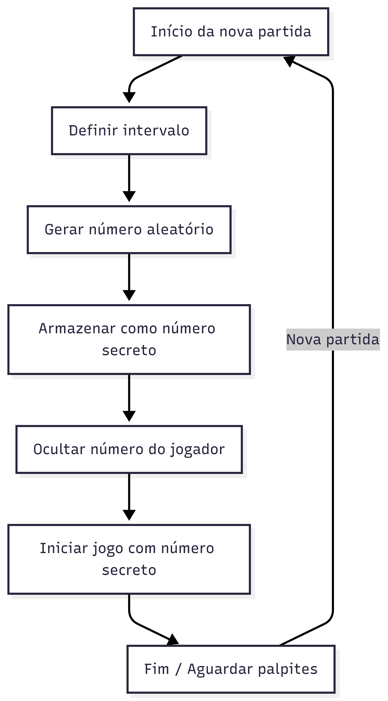 | **[UH03. Ciclo de Jogo com Feedback](#uh03-ciclo-de-jogo-com-feedback)** | 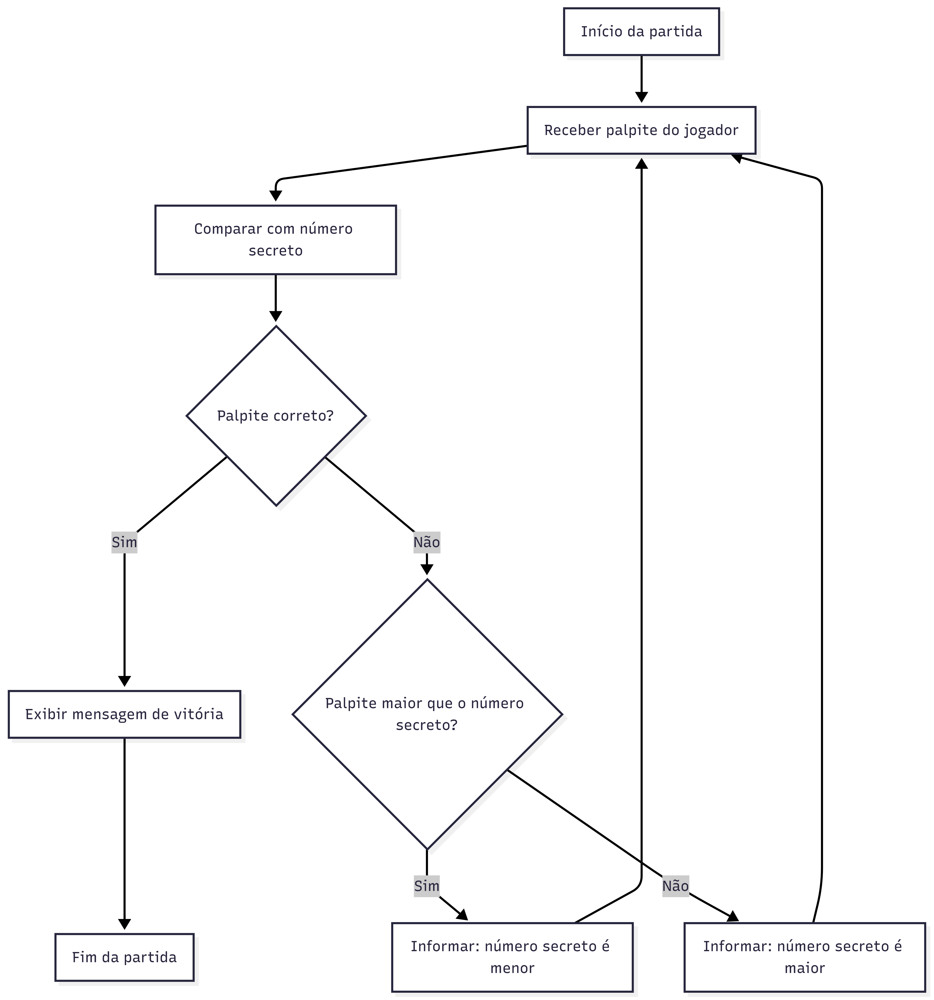 |
| **[UH04. Palpite Básico](#uh04-palpite-básico)** | 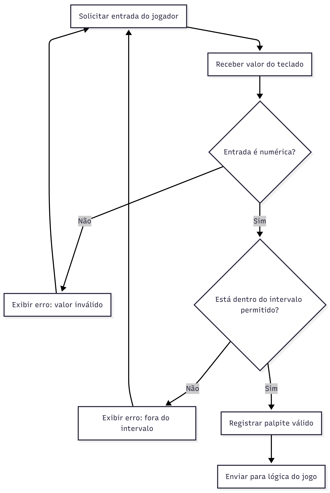 | **[UH05. Condição de Vitória](#uh05-condição-de-vitória)** | 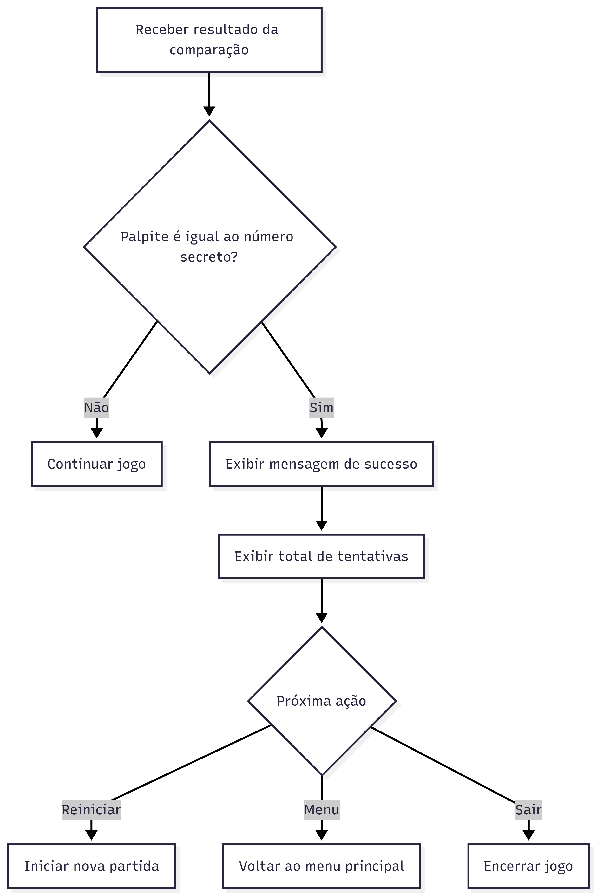 | **[UH06. Limite de Tentativas](#uh06-limite-de-tentativas)** | 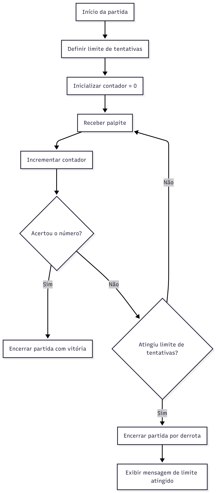 |
| **[UH07. Persistência de Dados](#uh07-persistência-de-dados)** | 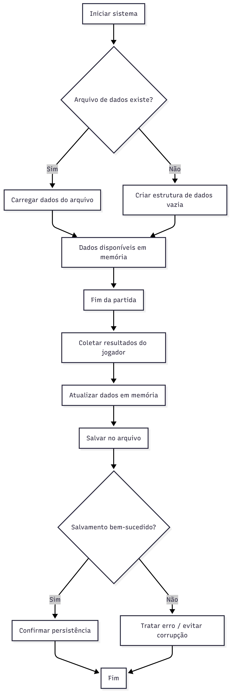 | **[UH08. Tratamento de Erros](#uh08-tratamento-de-erros)** | 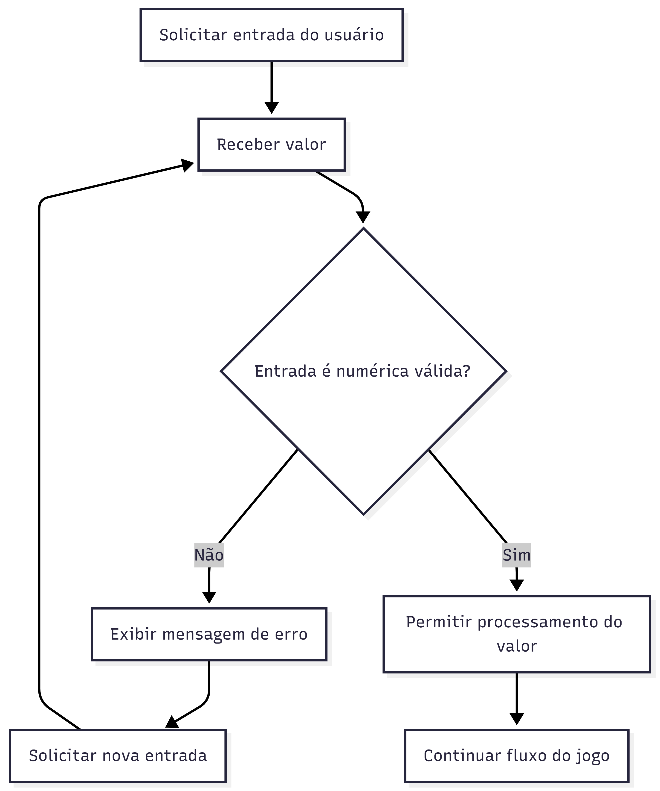 | **[UH09. Reinicialização](#uh09-reinicialização)** | 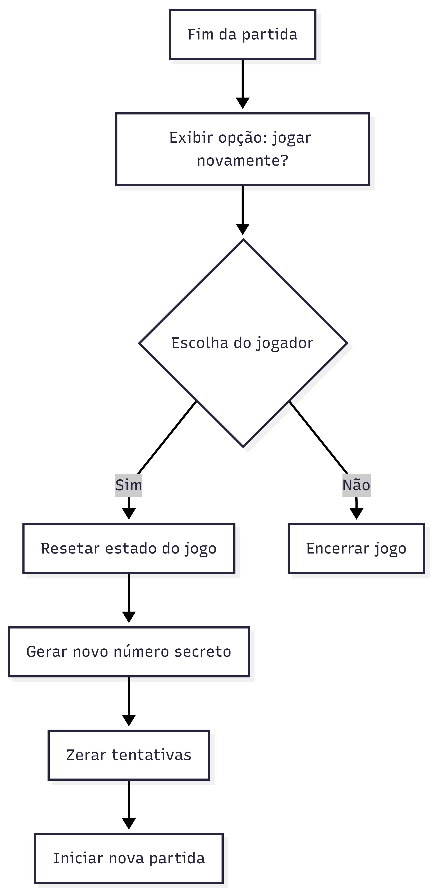 |
| **[UH10. Cálculos Base (Recursão)](#uh10-cálculos-base-recursão)** | 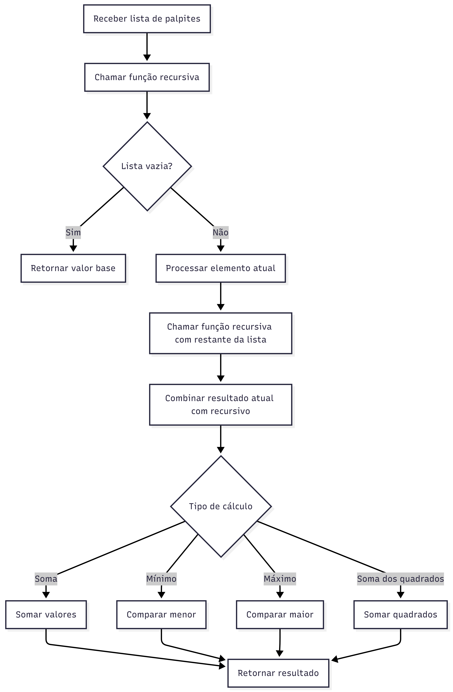 | **[UH11. Recorde Local (High Score)](#uh11-recorde-local-high-score)** | 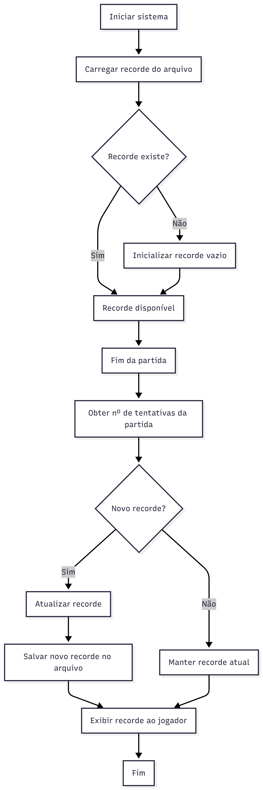 | **[UH12. Estatísticas Agregadas](#uh12-estatísticas-agregadas)** | 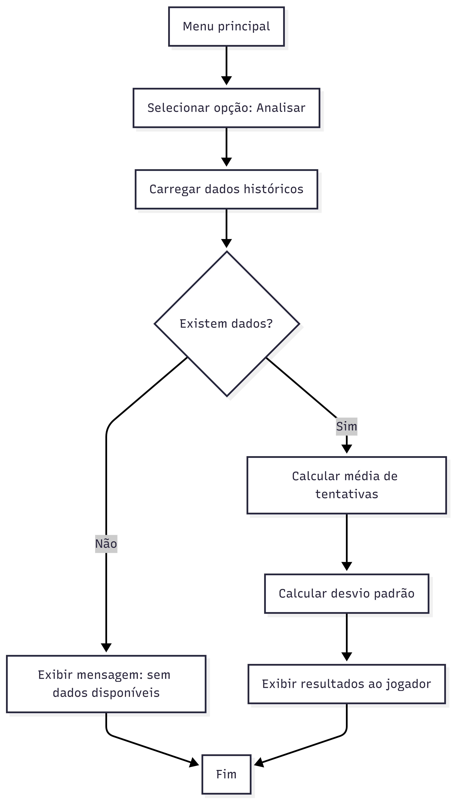 |
| **[UH13. Heurística de Estratégia](#uh13-heurística-de-estratégia)** | 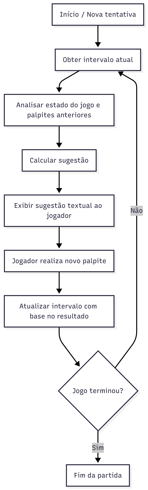 | **[UH14. Leitura e Parsing do Histórico](#uh14-leitura-e-parsing-do-histórico)** | 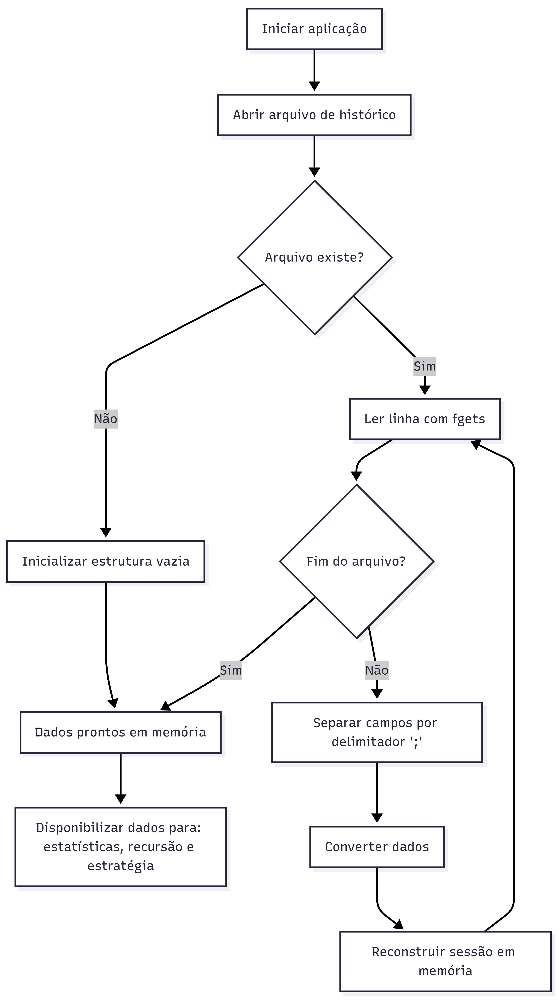 | | |

---

## Diagramas Detalhados

**➡️ [DIAGRAMAS-UML.md](docs/DIAGRAMAS-UML.md) - Diagramas de Fluxo das Funcionalidades**

> 📐 Consulte o documento de diagramas para visualização completa dos fluxogramas de cada funcionalidade, renderizados com Mermaid.

--------------

## 📥 Instalação e Compilação

Para instruções detalhadas sobre como baixar, compilar e executar o jogo em Windows, Linux ou MacOS, consulte o guia completo:

**➡️ [INSTALACAO.md](docs/INSTALACAO.md) - Guia Completo de Instalação e Compilação**

> 📖 Consulte o guia de instalação para instruções detalhadas de pré-requisitos, compilação e troubleshooting para todas as plataformas.

## 💻 Desenvolvimento

### Usando VSCode
- Pressione `CTRL+SHIFT+B` para compilar
- Pressione `F5` para compilar e debugar

📖 Para configurações avançadas, consulte [INSTALACAO.md](docs/INSTALACAO.md)

## 👥 Programação em Pares

Durante o desenvolvimento do projeto, utilizamos a técnica de **Pair Programming** para implementar funcionalidades críticas. Esta abordagem colaborativa trouxe aprendizados valiosos para a equipe.

**➡️ [PAIR-PROGRAMMING.md](docs/PAIR-PROGRAMMING.md) - Relatos e Experiências da Equipe**

> 🤝 Confira os relatos de Vinícius Pessoa e Wesley Yuri sobre a experiência de programar em dupla, desafios enfrentados e aprendizados adquiridos.

## 🎨 Customização

### Cores do Tema
Edite as constantes de cor em [src/main.c](src/main.c):

```c
#define COLOR_CYBER_GREEN (Color){0, 255, 156, 255}
#define COLOR_ALERT_YELLOW (Color){255, 215, 0, 255}
#define COLOR_DANGER_RED (Color){255, 59, 59, 255}
```

### Dificuldade do Jogo
Altere as constantes no início do arquivo:

```c
#define MAX_ATTEMPTS 7        // Número máximo de tentativas
#define MAX_PARTICLES 50      // Quantidade de partículas visuais
```

### Resolução da Janela
```c
#define SCREEN_WIDTH 1280
#define SCREEN_HEIGHT 720
```
## 👥 Equipe de Desenvolvimento

| Integrante                          | Função                    |
| ----------------------------------- | ------------------------- |
| Vinicius Pessoa de Albuquerque      | Tech Lead / Arquitetura   |
| Pedro Pessoa de Albuquerque Neto    | Desenvolvimento / QA      |
| Roberto Henrique Cavalcanti Freitas | Back-end / Persistência   |
| Saulo Eduardo Almeida dos Santos    | Estatísticas              |
| Thayna Vercosa de Andrade           | Product Owner             |
| Thiago Cardozo da Conceição         | Heurísticas               |
| Vinicius Wagner Gomes Germano       | Interface e Gameplay      |
| Vitória Gabrielly Gomes da Silva    | QA                        |
| Wesley Yuri da Silva                | Parsing e Reinicialização |
| Yasmin Karolina Silva de M. Godinho | Gameplay                  |


## 🤝 Contribuindo


1. Fork o projeto
2. Crie uma branch para sua feature (`git checkout -b feature/MinhaFeature`)
3. Commit suas mudanças (`git commit -m 'Adiciona MinhaFeature'`)
4. Push para a branch (`git push origin feature/MinhaFeature`)
5. Abra um Pull Request

### Ideias para Implementar
- [ ] Sistema de som/música
- [ ] Mais efeitos visuais (scanlines, chromatic aberration)
- [ ] Fonte customizada monoespaçada
- [ ] Persistência de estatísticas em arquivo
- [ ] Múltiplos níveis de dificuldade
- [ ] Modo multiplayer local
- [ ] Tradução para outros idiomas

## 📜 Licença

Este projeto está sob a licença MIT. Veja o arquivo [LICENSE](LICENSE) para mais detalhes.

---

**🎮 Divirta-se decifrando senhas no futuro cyberpunk de 2047! 👻**

