

  <h1>📐 Diagramas UML das Funcionalidades</h1>

Diagramas de fluxo representando a lógica de cada história de usuário do GH0ST: 2047.

---

## Índice

| # | Funcionalidade | Prioridade |
|---|---------------|------------|
| [UH01](#uh01-interface-principal-menu) | Interface Principal (Menu) | Alta |
| [UH02](#uh02-geração-de-número) | Geração de Número | Alta |
| [UH03](#uh03-ciclo-de-jogo-com-feedback) | Ciclo de Jogo com Feedback | Alta |
| [UH04](#uh04-palpite-básico) | Palpite Básico | Alta |
| [UH05](#uh05-condição-de-vitória) | Condição de Vitória | Alta |
| [UH06](#uh06-limite-de-tentativas) | Limite de Tentativas | Alta |
| [UH07](#uh07-persistência-de-dados) | Persistência de Dados | Média |
| [UH08](#uh08-tratamento-de-erros) | Tratamento de Erros | Média |
| [UH09](#uh09-reinicialização) | Reinicialização | Média |
| [UH10](#uh10-cálculos-base--recursão) | Cálculos Base (Recursão) | Baixa |
| [UH11](#uh11-recorde-local--high-score) | Recorde Local (High Score) | Baixa |
| [UH12](#uh12-estatísticas-agregadas) | Estatísticas Agregadas | Baixa |
| [UH13](#uh13-heurística-de-estratégia) | Heurística de Estratégia | Baixa |
| [UH14](#uh14-leitura-e-parsing-do-histórico) | Leitura e Parsing do Histórico | Média |

---

## UH01. Interface Principal (Menu)

O jogador acessa o menu principal com as opções Jogar, Analisar e Sair.

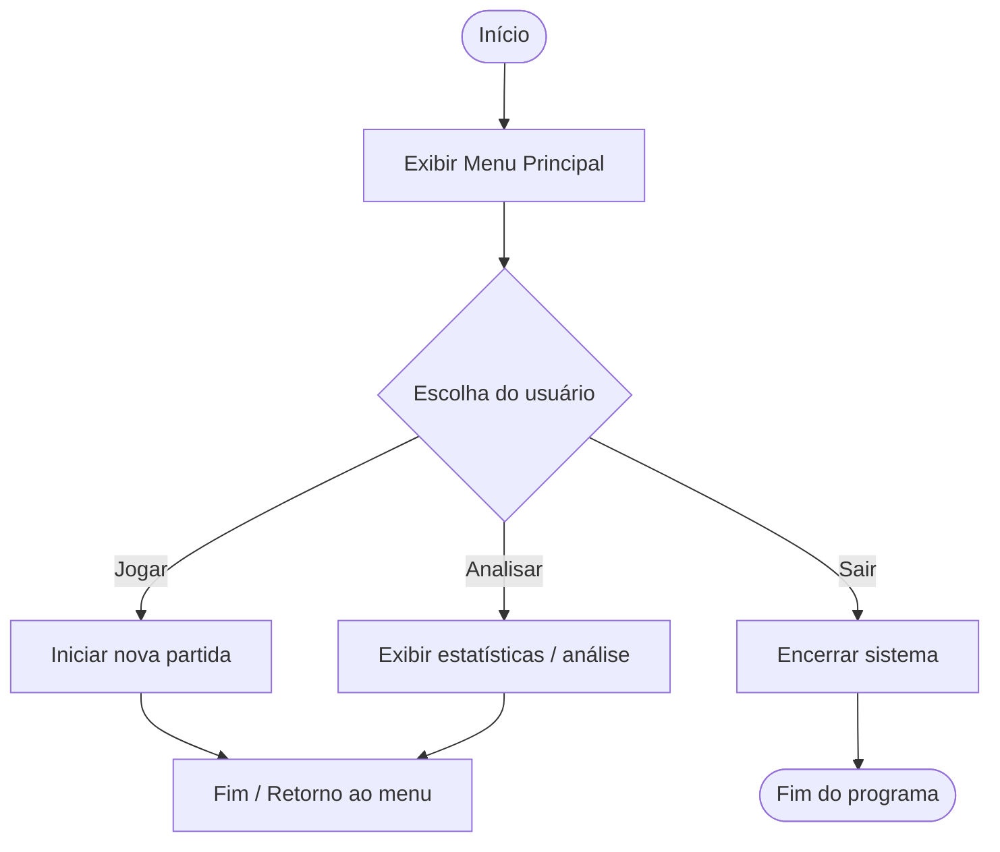

---

## UH02. Geração de Número

O sistema gera um número aleatório secreto dentro do intervalo definido (1–100).

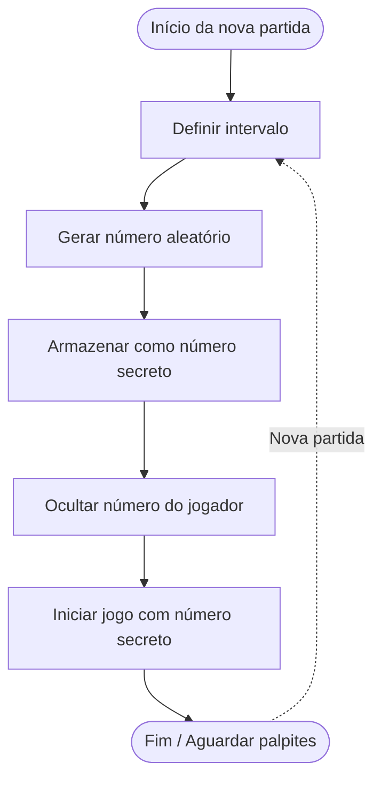

---

## UH03. Ciclo de Jogo com Feedback

O jogador insere palpites e recebe dicas de "maior" ou "menor" até acertar.

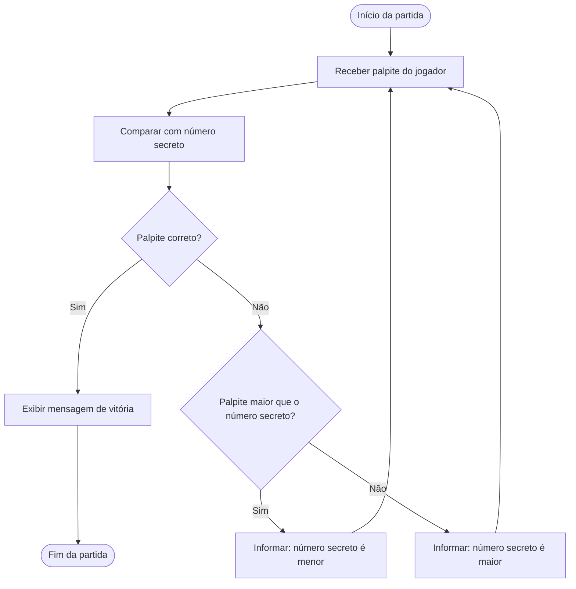

---

## UH04. Palpite Básico

Captura e validação da entrada numérica do jogador via teclado.

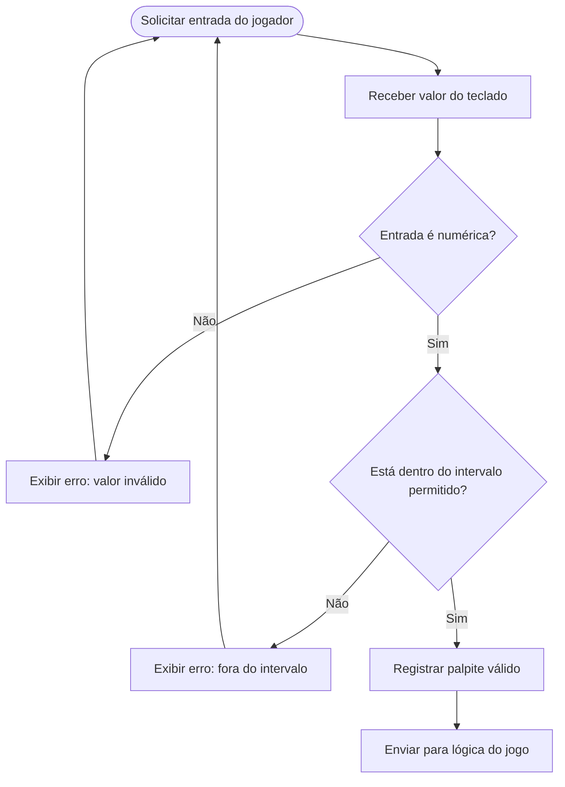

---

## UH05. Condição de Vitória

Detecção de acerto e exibição de mensagem de sucesso ao jogador.

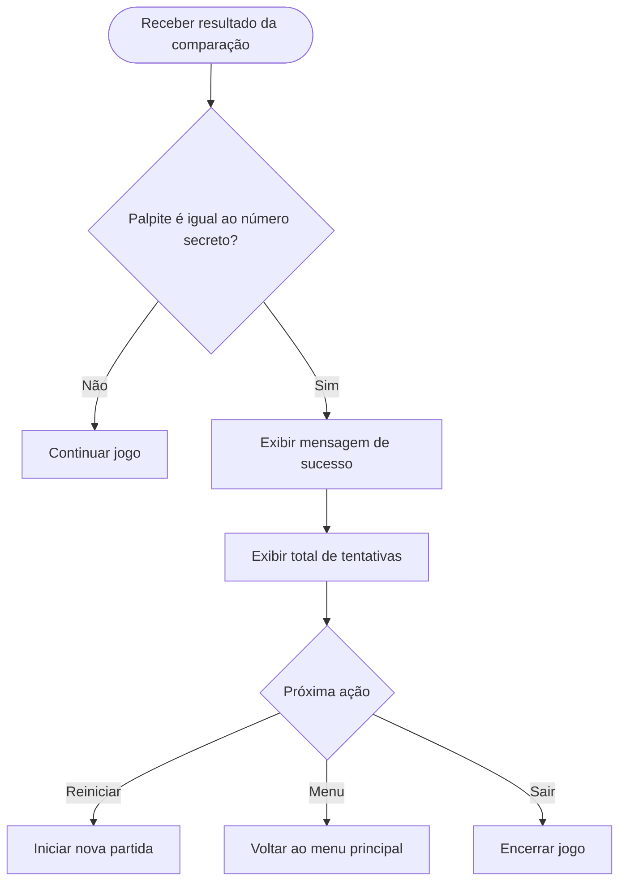

---

## UH06. Limite de Tentativas

Controle do número máximo de tentativas (7) com encerramento por derrota.

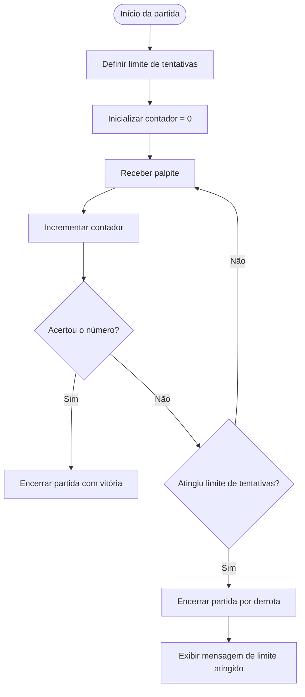

---

## UH07. Persistência de Dados

Salvamento e carregamento automático de resultados em arquivo CSV.

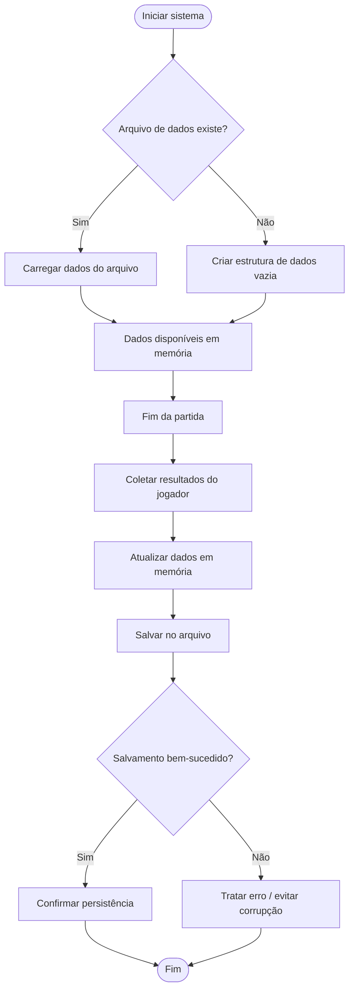

---

## UH08. Tratamento de Erros

Validação de entrada numérica e tratamento de caracteres inválidos.

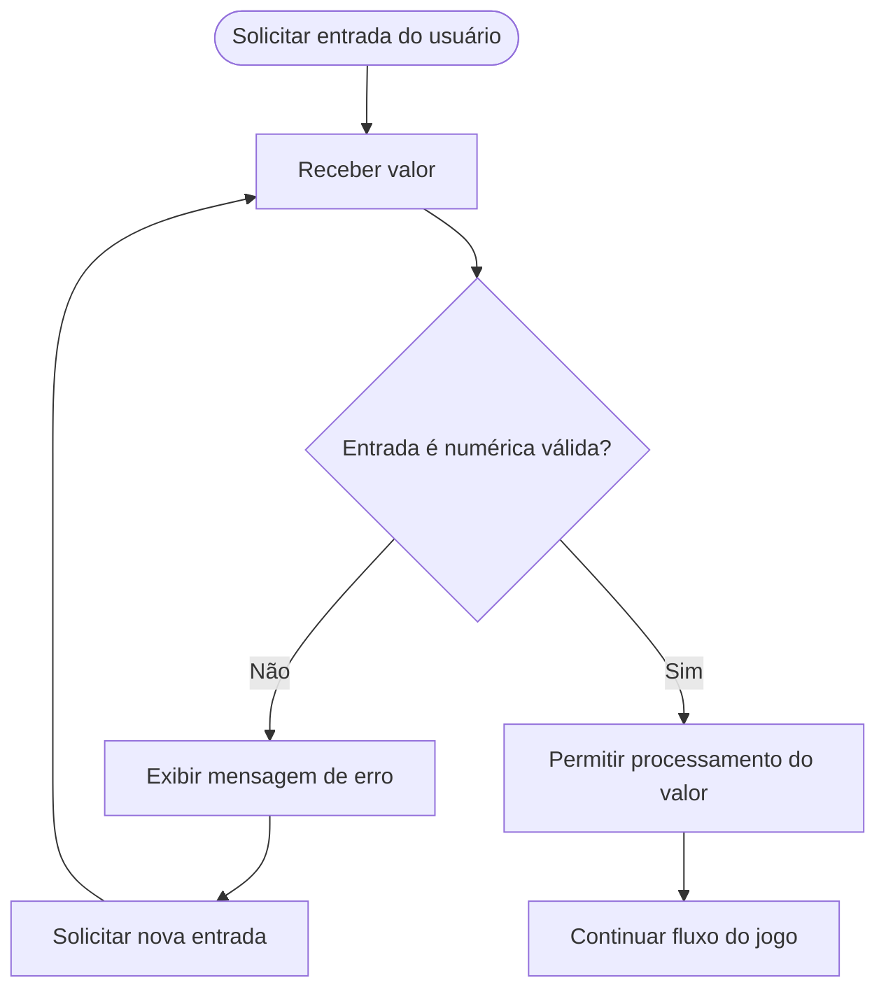

---

## UH09. Reinicialização

Opção de jogar novamente após fim da partida com reset completo de estado.

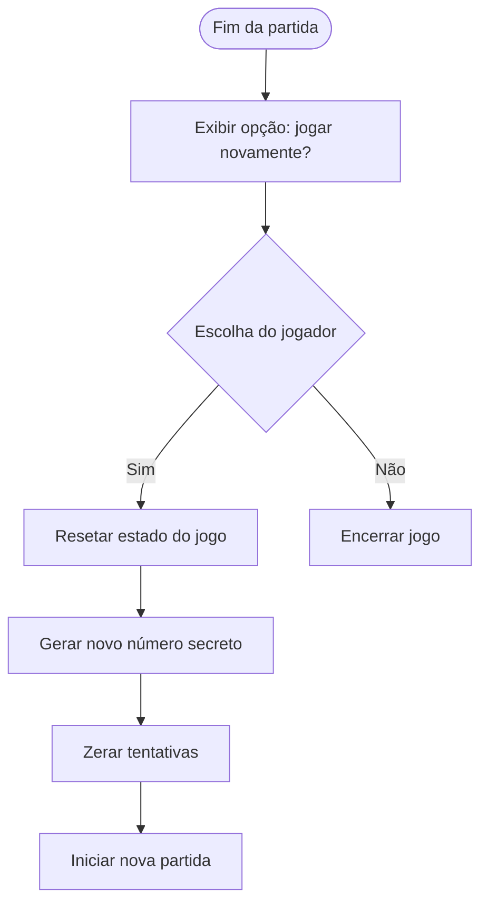

---

## UH10. Cálculos Base — Recursão

Funções recursivas para soma, mínimo, máximo e soma dos quadrados dos palpites.

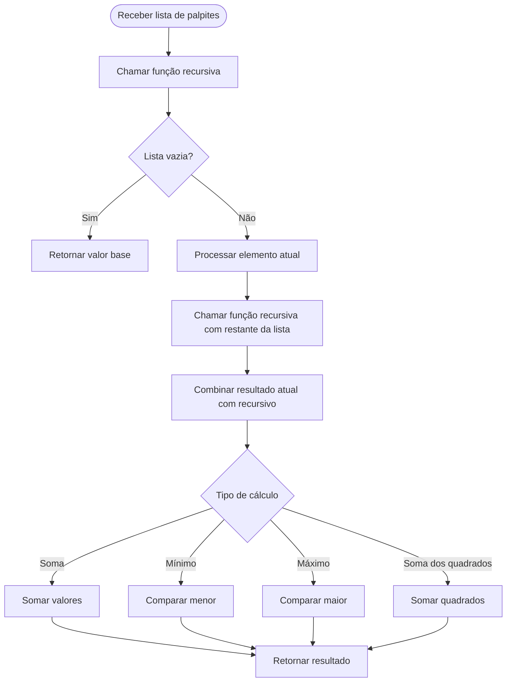

---

## UH11. Recorde Local — High Score

Registro e exibição da menor quantidade de tentativas entre todas as sessões.

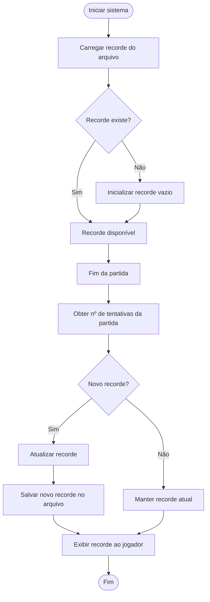

---

## UH12. Estatísticas Agregadas

Cálculo e exibição de média de tentativas e desvio padrão do jogador.

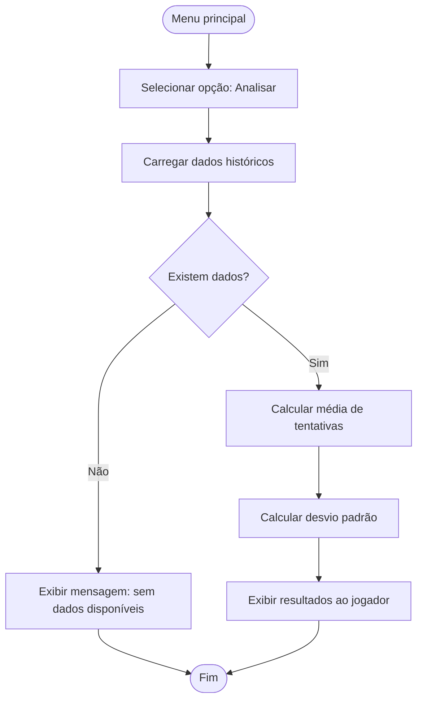

---

## UH13. Heurística de Estratégia

Sugestões textuais de estratégia baseadas no intervalo atual (busca binária).

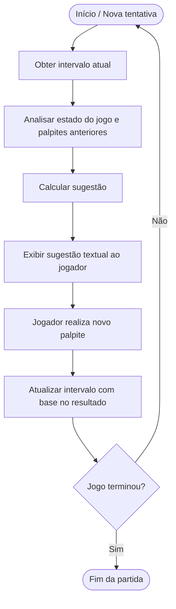

---

## UH14. Leitura e Parsing do Histórico

Carregamento e parsing do arquivo CSV com reconstrução de sessões em memória.

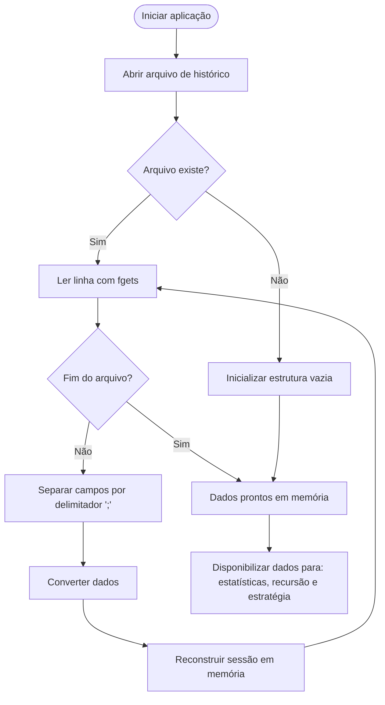

---

**[⬅️ Voltar ao README](../README.md)**

