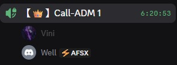

# 👥 Experiência de Programação em Pares

Este documento contém os relatos da experiência de programação em pares durante o desenvolvimento do **GH0ST: 2047**.

## 📖 Sobre Programação em Pares

Programação em pares (Pair Programming) é uma técnica ágil onde dois programadores trabalham juntos em uma mesma estação de trabalho. Um atua como "piloto" (driver), escrevendo o código, enquanto o outro atua como "navegador" (observer), revisando cada linha e pensando estrategicamente sobre a solução.

### Benefícios da Técnica
- 🧠 **Compartilhamento de conhecimento** - Troca contínua de experiências
- 🐛 **Menos bugs** - Revisão em tempo real do código
- 💡 **Melhor design** - Duas perspectivas na solução
- 🎯 **Foco aumentado** - Menos distrações durante o desenvolvimento
- 🤝 **Colaboração** - Fortalecimento do trabalho em equipe

---

## 👨‍💻 Relatos da Equipe

### Vinicius Pessoa de Albuquerque
**Função**: Tech Lead / Arquitetura  
**Par**: Wesley Yuri da Silva

#### Experiência e Aprendizados

A experiência de programar em par foi muito boa. Programei junto com Wesley, que já é meu amigo há muito tempo, e percebi que a programação em par deixa o ambiente mais leve, porque você fica ali conversando enquanto programa. Além disso, facilita bastante, pois não é necessário pensar sozinho, mas sim em conjunto, o que torna tudo mais fácil e prático.

No começo, eu fiquei conduzindo, ou seja, digitando o código, enquanto ele acompanhava e revisava para verificar se não havia erros, além de sugerir melhorias também. Depois, nós invertemos os papéis para ter a experiência dos dois lados da moeda.

**Principais desafios:**
- Coordenação inicial entre piloto e navegador
- Adaptação ao ritmo de trabalho compartilhado
- Comunicação constante para manter ambos alinhados

**Principais conquistas:**
- Implementação do sistema de salvar e carregar histórico
- Desenvolvimento de funções analíticas e recursivas
- Adição de timestamp em tempo real
- Criação do botão de sair com tratamento adequado

**O que aprendi:**
- A importância do trabalho em equipe no desenvolvimento de software
- Como a revisão em tempo real reduz erros e melhora a qualidade do código
- Que programar em dupla torna o processo mais eficiente e organizado
- A experiência de atuar tanto como piloto quanto como navegador enriquece o aprendizado 

---

### Wesley Yuri da Silva
**Função**: Parsing e Reinicialização  
**Par**: Vinicius Pessoa de Albuquerque

#### Experiência e Aprendizados

*A experiência foi compartilhada com Vinicius, onde alternamos papéis entre piloto e navegador. O trabalho colaborativo permitiu revisão contínua do código e troca de ideias em tempo real.*

**Principais desafios:**
- Manter o foco como navegador durante longos períodos de codificação
- Sugerir melhorias sem interromper o fluxo do piloto
- Equilibrar a participação ativa em ambos os papéis

**Principais conquistas:**
- Colaboração efetiva no sistema de persistência de histórico
- Contribuição nas funções analíticas e recursivas
- Implementação conjunta do sistema de timestamp
- Desenvolvimento do fluxo de saída do programa

**O que aprendi:**
- A importância de comunicação clara durante o desenvolvimento
- Como a revisão em par identifica problemas rapidamente
- A eficácia da troca de papéis para compreensão completa do código
- O valor da amizade e confiança mútua no trabalho colaborativo 

---

## 🎯 Funcionalidades Desenvolvidas em Pair Programming

- [x] Sistema de salvar histórico de partidas
- [x] Sistema de carregar histórico de partidas
- [x] Botão de sair do jogo com tratamento adequado
- [x] Timestamp em tempo real nas sessões
- [x] Funções analíticas para estatísticas
- [x] Funções recursivas no código
- [x] Validação e tratamento de dados
- [x] Sistema de persistência de dados

---

## 💭 Reflexões Finais

### O que funcionou bem?
- A amizade prévia facilitou a comunicação e colaboração
- Alternância de papéis (piloto/navegador) proporcionou aprendizado completo
- O ambiente se tornou mais leve e descontraído durante o desenvolvimento
- Revisão em tempo real reduziu significativamente erros no código
- O pensamento conjunto tornou a solução de problemas mais rápida

### O que poderia melhorar?
- Estabelecer intervalos mais regulares para manter o foco
- Documentar melhor as decisões tomadas durante as sessões
- Definir tempo fixo para cada rodada de troca de papéis

### Recomendaríamos pair programming para outros projetos?
- **Sim, definitivamente!** A experiência mostrou que programar em par torna o desenvolvimento mais eficiente, organizado e agradável. O trabalho em equipe não apenas melhora a qualidade do código, mas também fortalece o aprendizado e a confiança entre os membros da equipe. Recomendamos especialmente para funcionalidades críticas e complexas do sistema. 

---

## 📚 Referências

- [Extreme Programming: Pair Programming](http://www.extremeprogramming.org/rules/pair.html)
- [Martin Fowler - On Pair Programming](https://martinfowler.com/articles/on-pair-programming.html)

---

## 🔙 Voltar

⬅️ [Voltar para README principal](../README.md) | 📚 [Ver toda documentação](README.md)
