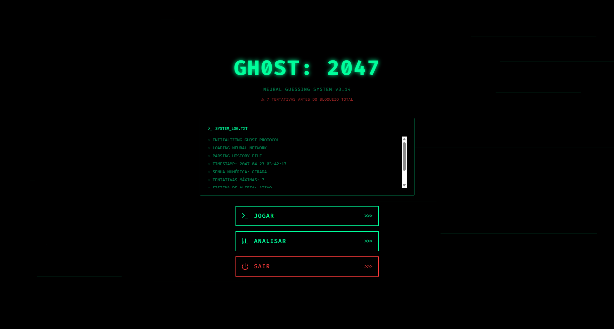
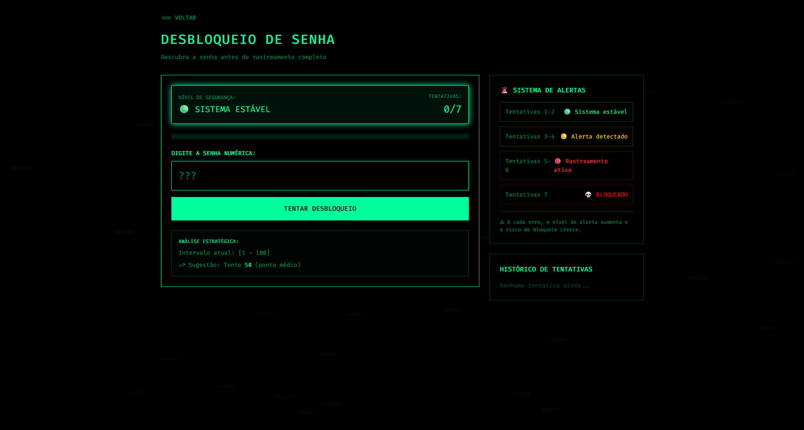
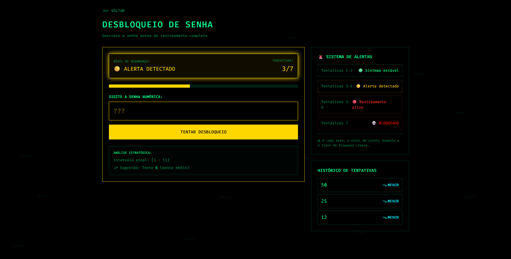
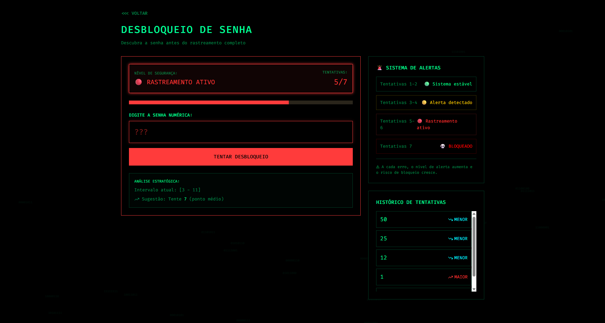
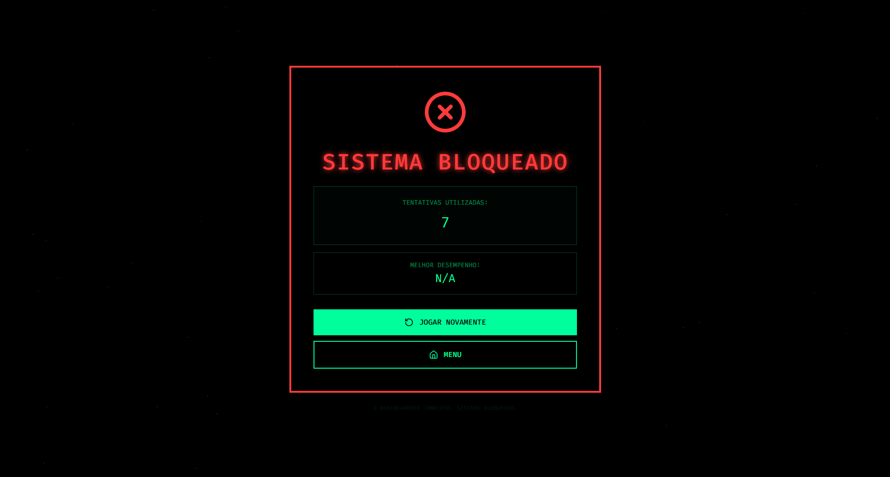
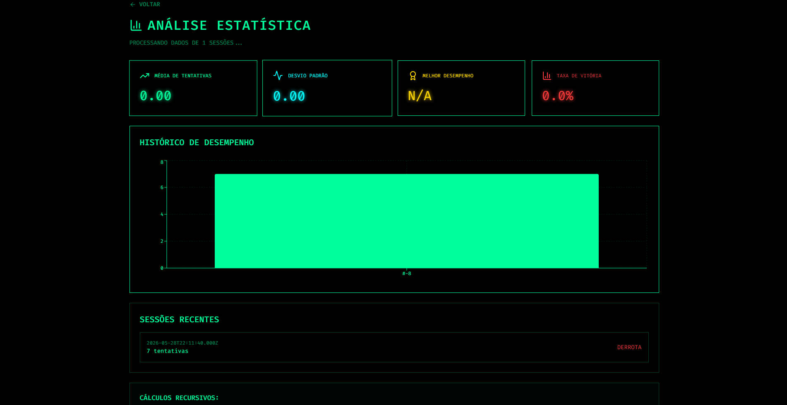
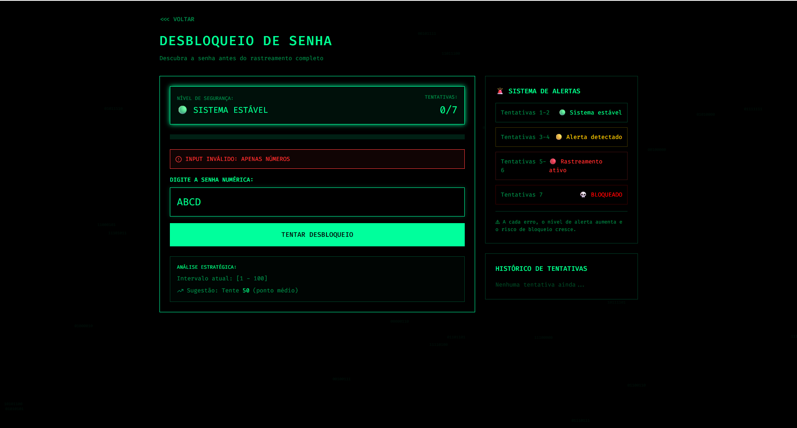
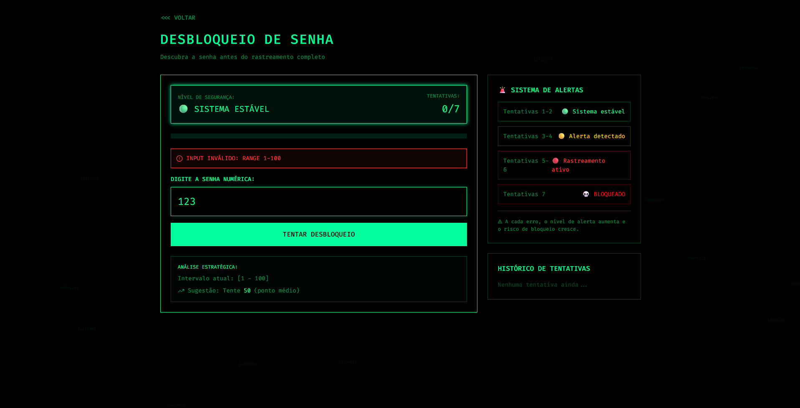

  <h1>🎨 Protótipo de Interface — GH0ST: 2047</h1>

O protótipo de interface do GH0ST: 2047 foi desenvolvido para validar o fluxo de navegação, a experiência visual cyberpunk e a usabilidade do sistema antes da implementação final.

A abordagem priorizou **alta fidelidade**, com tema neon/hacker, permitindo validar a identidade visual e coletar feedback sobre a interação.

---

## 📋 Telas do Protótipo

### 🏠 Menu Principal

Tela inicial com as opções de navegação: Jogar, Analisar e Sair.

  

---

### 🎮 Início de Partida — Alerta Mínimo

Tela de gameplay no início da partida (tentativas 1-2), com o sistema em estado estável.

  

---

### ⚠️ Alerta Moderado

Estado intermediário de alerta (tentativas 3-4), onde o sistema detecta a invasão.

  

---

### 🚨 Alerta Máximo — Rastreamento Ativo

Estado crítico de alerta (tentativas 5-7), com rastreamento ativo da localização do jogador.

  

---

### 💀 Final do Jogo — Bloqueado

Tela de derrota quando o jogador esgota todas as tentativas e é bloqueado pelo sistema.

  

---

### 📊 Análise Estatística

Tela de estatísticas com média de tentativas e desvio padrão do desempenho do jogador.

  

---

### 🛡️ Tratamento de Input — Letras

Feedback visual quando o jogador tenta inserir caracteres não numéricos.

  

---

### 🛡️ Tratamento de Input — Fora do Intervalo

Feedback visual quando o jogador insere um número fora do intervalo permitido (1–100).

  

---

## 🎯 Objetivos do Protótipo

- Validar a identidade visual cyberpunk/neon
- Definir o fluxo principal de navegação
- Testar o sistema progressivo de alertas visuais
- Validar o feedback de erros de entrada
- Verificar legibilidade e hierarquia de informações

## 🧩 Decisões de Design

| Princípio | Aplicação |
|-----------|-----------|
| **Visibilidade do sistema** | Tentativas, range e alertas sempre visíveis |
| **Feedback imediato** | Respostas visuais instantâneas a cada palpite |
| **Consistência** | Paleta neon/cyberpunk mantida em todas as telas |
| **Prevenção de erros** | Validação visual clara de entradas inválidas |
| **Reconhecimento** | Interface intuitiva sem necessidade de memorização |

---

**[⬅️ Voltar ao README](../README.md)**

